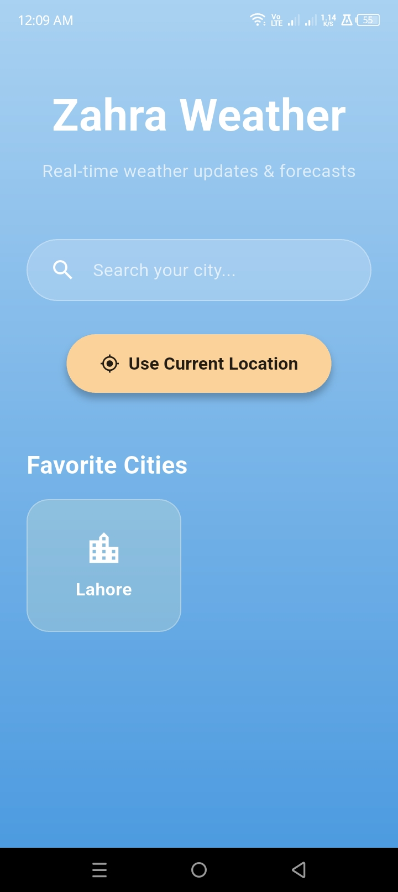
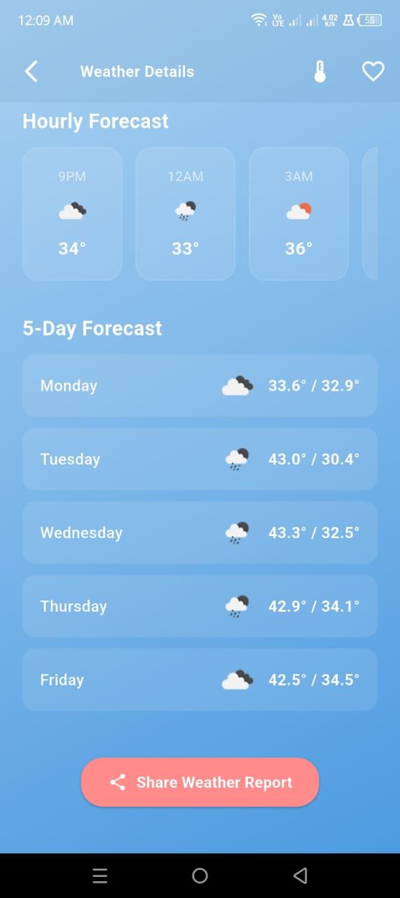
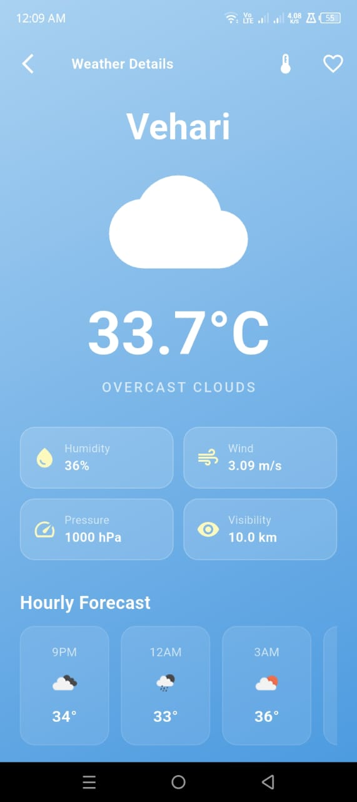

# 🌤️ Zahra Weather App


> **Real-time weather updates & forecasts — beautifully designed, built with Flutter.**

A fully functional cross-platform weather app that delivers real-time weather data, hourly forecasts, and 5-day predictions using the OpenWeatherMap API. Built with Flutter and Riverpod for clean, reactive state management.

---

## 📱 Screenshots
<div align="center">
  <table>
    <tr>
      <td align="center"><b>Home Screen</b></td>
      <td align="center"><b>Weather Details</b></td>
      <td align="center"><b>Forecast</b></td>
    </tr>
    <tr>
      <td></td>
      <td></td>
      <td></td>
    </tr>
  </table>
</div>

> 📸 *Add your screenshots to a `/screenshots` folder in the repo.*

---

## ✨ Features

- 🔍 **City Search** — Search weather for any city worldwide
- 📍 **Current Location** — Auto-detect location using GPS
- ⏱️ **Hourly Forecast** — Hour-by-hour weather breakdown
- 📅 **5-Day Forecast** — Plan your week ahead
- ❤️ **Favorite Cities** — Save and quickly access your favorite locations
- 📤 **Share Weather Report** — Share weather info with friends
- 💧 **Detailed Metrics** — Humidity, wind speed, pressure, visibility
- 🌐 **Smooth Animations** — Lottie animations for a polished UI
- 📲 **Responsive UI** — Works beautifully on all screen sizes

---

## 🏗️ Tech Stack

| Layer | Technology |
|---|---|
| Framework | Flutter 3.x |
| Language | Dart 3.x |
| State Management | flutter_riverpod |
| Weather API | OpenWeatherMap |
| Location | geolocator + geocoding |
| Storage | shared_preferences |
| Environment | flutter_dotenv |
| Animations | Lottie |
| Sharing | share_plus |

---

## 🚀 Getting Started

### Prerequisites

- Flutter SDK `^3.10.8` — [Install Flutter](https://docs.flutter.dev/get-started/install)
- Dart SDK `^3.x`
- An **OpenWeatherMap API Key** — [Get free API key](https://openweathermap.org/api)
- Android Studio / VS Code with Flutter extension

### Installation

1. **Clone the repository**
   ```bash
   git clone https://github.com/YOUR_USERNAME/zahra-weather-app.git
   cd zahra-weather-app
   ```

2. **Install dependencies**
   ```bash
   flutter pub get
   ```

3. **Set up environment variables**

   Create a `.env` file in the project root:
   ```env
   OPENWEATHER_API_KEY=your_api_key_here
   ```
   > ⚠️ Never commit your `.env` file. It is already added to `.gitignore`.

4. **Run the app**
   ```bash
   flutter run
   ```

---

## 📁 Project Structure

```
lib/
├── main.dart                  # App entry point & Riverpod setup
├── models/
│   └── weather_model.dart     # Weather data models
├── services/
│   └── weather_service.dart   # OpenWeatherMap API calls
├── providers/
│   └── weather_provider.dart  # Riverpod state providers
├── screens/
│   ├── home_screen.dart       # Home / City search screen
│   └── weather_details_screen.dart  # Detailed weather view
└── widgets/
    └── weather_widgets.dart   # Reusable UI components
```

---

## 🔑 API Reference

This app uses the **OpenWeatherMap API**:

- **Current Weather:** `GET /weather?q={city}&appid={key}`
- **5-Day Forecast:** `GET /forecast?q={city}&appid={key}`
- **By Coordinates:** `GET /weather?lat={lat}&lon={lon}&appid={key}`

Sign up at [openweathermap.org](https://openweathermap.org/api) to get a free API key (1,000 calls/day on the free tier).

---

## 🔐 Environment Variables

| Variable | Description |
|---|---|
| `OPENWEATHER_API_KEY` | Your OpenWeatherMap API key |

---

## 📦 Dependencies

```yaml
dependencies:
  flutter_riverpod: ^2.4.9    # State management
  http: ^0.13.6               # API calls
  flutter_dotenv: ^5.1.0      # Environment config
  geolocator: ^10.1.0         # GPS location
  geocoding: ^2.1.1           # Reverse geocoding
  shared_preferences: ^2.2.2  # Local storage
  shimmer: ^3.0.0             # Loading skeleton
  lottie: ^2.7.0              # Animations
  share_plus: ^7.2.1          # Share functionality
  intl: ^0.18.1               # Date formatting
```

---

## 🤝 Contributing

Contributions are welcome! Here's how:

1. Fork the repository
2. Create your feature branch: `git checkout -b feature/AmazingFeature`
3. Commit your changes: `git commit -m 'Add some AmazingFeature'`
4. Push to the branch: `git push origin feature/AmazingFeature`
5. Open a Pull Request

---

## 📄 License

Distributed under the MIT License. See [`LICENSE`](LICENSE) for more information.

---

## 👩‍💻 Author

**Zahra** — Flutter Developer

[](https://github.com/YOUR_USERNAME)
[](https://linkedin.com/in/YOUR_PROFILE)

---

## ⭐ Show Your Support

If you found this project helpful, please give it a **⭐ star** on GitHub — it means a lot!

---

*Built with ❤️ using Flutter & OpenWeatherMap API*
